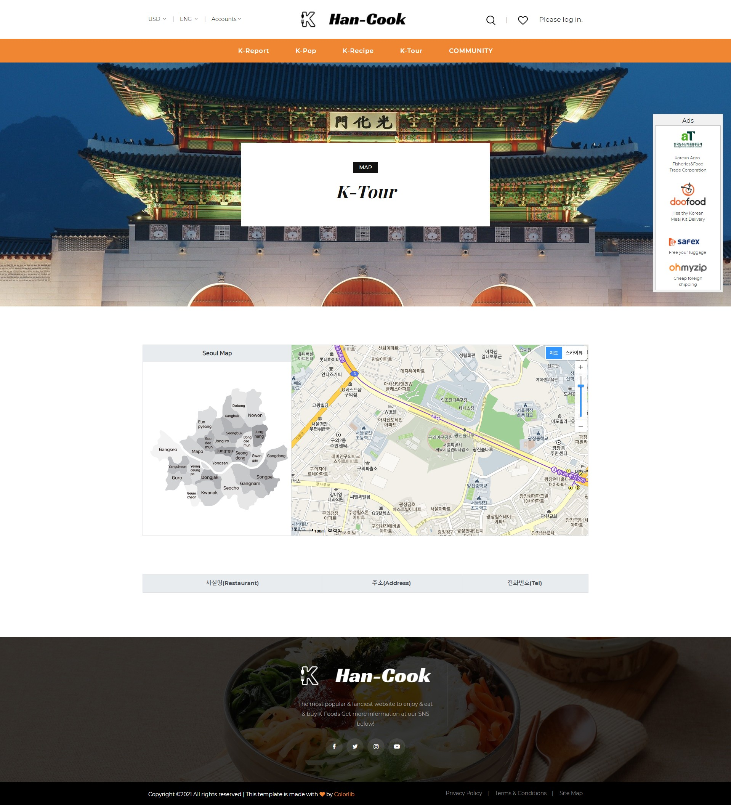

# 2021년 k-food 빅데이터 활용 창업경진대회 본선 진출작

- 한국농수산식품유통공사에서 진행한 경진대회였다. 뒤늦게 알아서 우선 신청서 부터 제출하고 구체적인 것들은 본선 진출 발표후에 하자고 하였다.
- 다행히 본선 진출이 확정되어 작업에 돌입했다. 처음 주제는 농산물 가격 예측이었는데 피드백 이후 이 주제로는 안 될것 같아서 한국의 음식을 알리자라는 주제로 변경하였다.
- 그래서 홈페이지 이름도 han cook이 되었고 거의 2주만에 데이터 분석이랑 홈페이지가 완성되었다. 모든 팀원들이 거의 밤을 새웠던 것 같다.
- 평일에도 회의 11시 넘어서까지 하고 주말동안 작업하고 또 회의하고의 반복이었다.
- 나같은 경우는 다행이 휴가가 겹쳐서 휴가기간동안 작업하였다.
- 급하게 주제를 바꾼것 치고는 만족할 만한 결과물이 나온 것 같다.

### 소스코드

https://github.com/sc303030/at_pythonanywhere

### 홈

- 홈 화면은 우선 우리나라를 대표하는 음식과 우리가 구성한 카테고리들을 보여주었다.
- k-repor, k-pop, k-recipe, k-tour, community 총 5개 메뉴로 구성되었다.

### 홈-언어변경

- 기본적으로 영어로 홈페이지를 작업했지만 구글 번역기를 넣어서 자동으로 언어를 번역해서 보여주는 것을 추가하였다. 우리가 미처 번역하지 못한 언어들도 같이 번역하도록 하였다.

### 언어 변경

### 회원가입, 로그인

- 원래는 넣을까 말까 의논했었는데 넣는게 좋을 것 같다고 해서 나중에 추가하였다.
- 뒤에 나오는 내가 좋아하는 스타 혹은 레시피를 저장하기 위해서 회원가입과 로그인 기능을 추가하였다.

### K-report

- 경진대회에서 필수적으로 사용해야하는 데이터들을 분석하여 정리한 부분이다.
- 분석 결과를 태블로로 시각화하여 보여주었다.
- 사용 데이터 목록은 아래와 같다.

| 사이트     | 데이터이름                                  |
| ---------- | ------------------------------------------- |
| KADX       | 외식 소비 패턴 데이터(메뉴 트랜드)          |
| KADX       | 음식 레시피 데이터                          |
| 공공데이터 | 서울시 착한 가격업소 현황 데이터            |
| 공공데이터 | 서울시 물가정보 데이터                      |
| 공공데이터 | 서울시 생필품 농수축산물 가격               |
| 공공데이터 | TV반영된 전국 맛집정보_2020                 |
| 공공데이터 | TV반영된 전국 맛집정보_2019                 |
| 공공데이터 | 서울특별시\_도봉구_맛집                     |
| 공공데이터 | 서울특별시\_용산구\_맛집_20200922           |
| 공공데이터 | 서울특별시\_광진구\_맛집멋집_20210129       |
| 공공데이터 | 농림축산식품부_국내 외식기업 해외 진출 현황 |
| 공공데이터 | 서울시 생필춤 농수축산물 가격               |

### K-report 기사 - 1

- 첫 번째 기사는 국내 외식기업 해외 진출 현황을 다루었다.

### K-report 기사 - 2

- 두 번째 기사는 맛집의 분포와 해외에서 인기있는 10개 음식들을 보여준다.

### K-report 기사 - 3

- 마지막은 우리가 기존에 주제로 잡았던 농식품 가격예측에서 분석했던 채소들의 가격 예측 그래프를 표현하였다. 1주일간의 가격을 예측하였다.

### K-pop

- 해외에서 유명한 아이돌이 좋아하는 음식들을 찾아서 정리한 부분이다. 
- 해당 아이돌을 클릭하면 멤버들이 좋아하는 음식들을 언급했던 매체로 이동하는 아이콘 하나와 해당 멤버의 분석 페이지로 넘어가는 아이콘 총 2개가 나온다.

### k-pop 동작

- 검색하거나 tag를 클릭하면 해당 아이돌을 보여준다.

### k-pop 상세페이지

- 위 gif에서 멤버를 클릭했을 때 멤버 사진을 클릭하면 이동하는 부분이다.
- 해당 멤버에 대한 기본적인 설명과 해당 멤버가 언급했던 한국 음식들을 보여준다.
- 같은 멤버나 혹은 같은 음식을 좋아하는 아이돌들을 보여주었다.
- 또한 관련된 음식들도 같이 보여주는 페이지다.

### k-pop 저장

- 로그인을 하고 하트를 클릭하면 마이페이지에 저장된다.

### k-pop 연관부분

- 해당 멤버가 먹방을 진행했던 영상 클립이나 연관된 아이돌, 레시피로 이동하는 부분이다.

### k-recipe

- 선택한 음식에 들어가는 재료들을 보여준다.
- 해당 재료들을 한국 가격으로 보여주어서 실제로 구매하게 되면 얼마인지 보여준다.
- 또한 우리 팀이 분석한 가격 동향 그래프도 같이 보여준다.
- 밀키트나 완제품을 구매하고 싶으면 해당 링크로 이동할 수 있다.

### k-recipe 계산

### k-recipe 동향그래프

- 시장과 마켓 가격의 1년치 동향을 보여준다.

### k-recipe 만드는 방법

- 실제로 음식을 만들기 위해 영어로 필요한 재료와 만드는 방법을 설명해준다.

### k-recipe 구체적인 방법

- 유튜브 영상으로 보거나 해당 글을 따라하면 된다.

### 이달의 음식이나 재료

- 원래 있던 모양을 바꾸는데 어려움을 겪었떤 부분이다.
- ajax로 불러오는데 기존이랑 다른 구성을 사용하고 있어서 해당 부분을 수정하고 나서 원하는 형태로 class를 부여하였다.
- 이달의 음식이나 재료를 볼 수 있고 해당 음식의 요리과정을 상세히 알려준다.
- 이 부분은 공공 api를 사용하였다.

### K-tour

- 서울 맛집을 지도로 표현하였다.
- 지도에서 구를 선택하고 맛집을 클릭하면 해당 맛집의 정보를 출력한다.

### k-tour 작동

- 지도 포인터를 넣으려고 하나씩 옮겼던게 힘들었던 부분이다.

### 커뮤니티

- 유저들이 참여할 수 있는 컨텐츠들이 있는 공간이다.
- 한국 음식 도전 난이도나 인기 음식, 투표하는 것들을 만들었다.

### 마이페이지

- 내가 즐겨찾기 했던 스타 혹은 기사들이 있고 할인 쿠폰등이 있는 페이지다.
- 쿠폰은 향후 서비스가 밀키트나 바로구매 같은 사이트들과 연계했을 때 거기서 구매시 적용되는 쿠폰이다.

